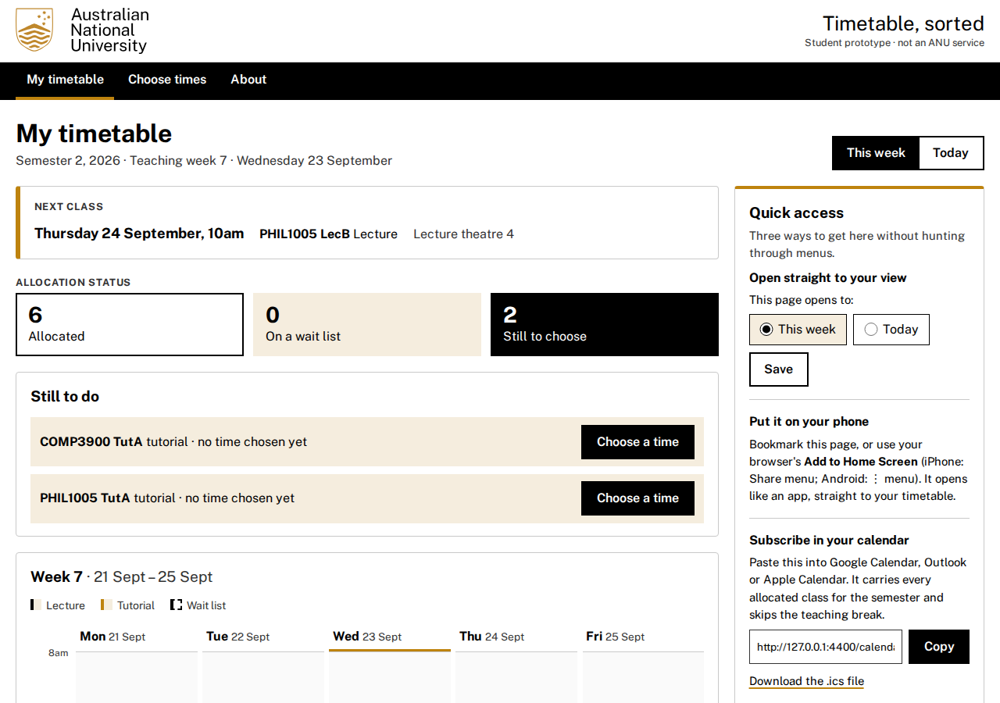
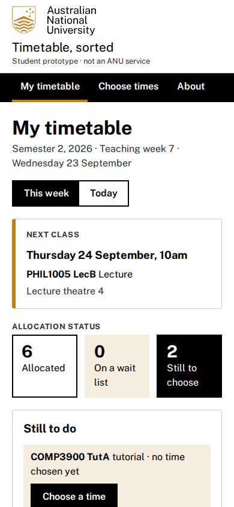

# Timetable, sorted

A rebuilt slice of ANU MyTimetable for one student's Semester 2, 2026
enrolment. MyTT's home page opens on a wall of notices. Your actual
timetable sits behind a tab, and the calendar link sits at the bottom of the
page. Here the home page *is* the timetable: your next class, what you still
have to choose, and the week at a glance. Choosing a tutorial time is one
page per course, with seats left and clashes shown before you commit.
Everything is stored in SQLite, so it survives a reload and a redeploy.

## What good looks like here

**Quick to reach.** The one thing asked for was quicker access to the
timetable, so the app offers three routes, all on the home page:

- a saved **"opens to"** option (This week or Today), stored in the
  database so it holds on every device
- a web manifest, so **Add to Home Screen** opens it like an app
- a **calendar feed** (`/calendar.ics`) of every allocated class, weekly
  through the semester, skipping the 7–18 September teaching break

A fourth shortcut goes to each course's official summary on ANU Programs
and Courses. It's linked from the Quick access panel, every class's details
page, each course's page and the course overview, and it opens in a new tab.

**Optimised, measured.** From the home page, choosing a tutorial is two
clicks and a save. Clashes are named in words rather than implied by
position, and a full class offers the wait list without costing you your
current seat. At phone width the grid becomes a per-day list rather than a
table that scrolls sideways.

**Every class opens its full record.** Click any class on the timetable, in
Today, in the next-class card or on Choose times. A details page opens with
MyTimetable's own fields: type, group, activity, description, day, time,
campus, location, staff, duration, dates and seats. It also lists every
class date, with the next one marked, and shows the building on an
OpenStreetMap map. The pin comes from ANU's own campus map, with links to
ANU's page for that room or building and to walking directions. An activity in two parts, such as
COMP3900 TutA/07 (a tutorial, then a drop-in), shows both parts.

**A planner that proposes a fair week.** The Planner page tries every
combination of tutorial times and drops any with a clash, or a full class
you don't already hold. It ranks the rest by rules shown on the page:
- an even spread of class time across the week
- few gaps between classes
- your own preferences: no classes before or after a time, a day kept free
- fewer changes, to break ties

Lectures are read only, so they never move. Each plan shows hours per day,
why it scored as it did, and which times it changes. "Use this plan" applies
the whole plan or none of it. "Fair" means fair to your week. The planner
can't know other students' needs, and alternative tutorial times are sample
data, so plans that use them say so.

**True where it claims to be.** The eight allocated activities are the
student's real MyTimetable records, copied field for field on 23 September
2026. One correction: the export printed "O?Donoghue", a lost apostrophe.
ANU's map names the building Lowitja O’Donoghue Cultural Centre. Each
record's own date list drives the week view and the calendar feed. So a
Monday class disappears on 5 October, when MyTimetable doesn't list it.
Course codes, titles, class numbers and semester dates are checked against
ANU Programs and Courses. Two things are **sample data**, hatched on the
grid and labelled on their pages:

- COMP3500's lecture, whose details weren't provided
- the alternative tutorial times under "Choose times", which MyTimetable
  only shows behind its login

COMP3500 appears in MyTT as "Computing Team Project", but Programs and
Courses 2026 calls it "Software Engineering Project". The app uses the
Programs and Courses title.

| What | How it's held |
| --- | --- |
| Choosing a time survives a reload; wait list keeps your seat; read-only groups refuse | `spec/crit-7.test.ts`, over HTTP against the built server |
| Each real record's details page carries every MyTT field | `spec/crit-7.test.ts`, against a table transcribed separately from the seed |
| Clash rule is half-open (9–10 and 10–11 don't clash); week numbers; next class; `.ics` output | literal fixtures in `spec/crit-7.test.ts` |
| No sideways scroll, nothing clipped, 24px targets, 12px text, axe incl. contrast | `pnpm audit:browser`, in Chromium at nine widths |
| Planner ranks by spread, gaps and preferences; never a clash or full class; applies all or nothing | fixtures with hand-worked scores, and HTTP tests, in `spec/crit-7.test.ts` |
| Whether it's actually easier than MyTT | judgement: the crit |

**ANU's own web style.** Colours and type follow the
[ANU Web Style Guide](https://webpublishing.anu.edu.au/web-style-guide/colours).
Everything is black and white, with ANU Gold `#BE830E` as a sparing highlight
and Gold tint `#F5EDDE` for panels. Text is black, with Unigrey `#333333` for
muted lines. The typeface is Public Sans, self-hosted. The guide has no
status or secondary colours, so courses are told apart by their codes and
state is carried by words and weight. An event's left edge marks a lecture
(black) or a tutorial (gold). The header follows ANU's own sites: the
official ANU logo (taken unmodified from `webstyle.anu.edu.au`) on a white
masthead, above a black navigation bar. Beside the logo, the header says
this is a student prototype and not an ANU service. The footer repeats it.

**Not built:** sign-in and more than one student, swapping with another
student, sessional (X1–X4) courses, and any connection to the real MyTT.
